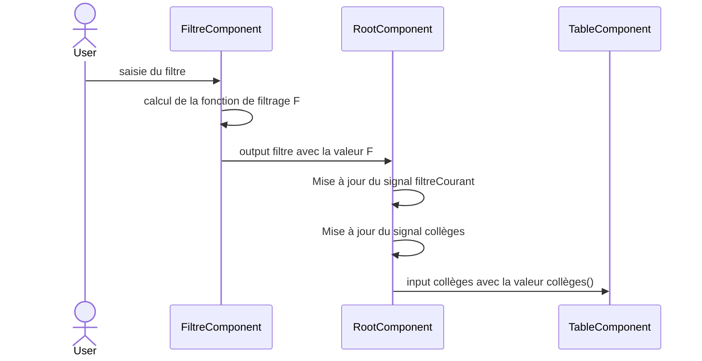
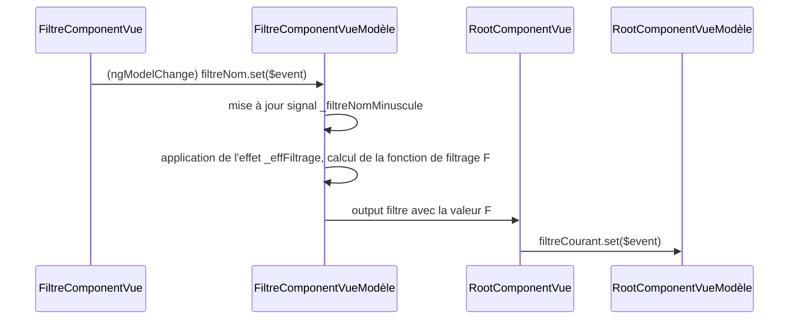
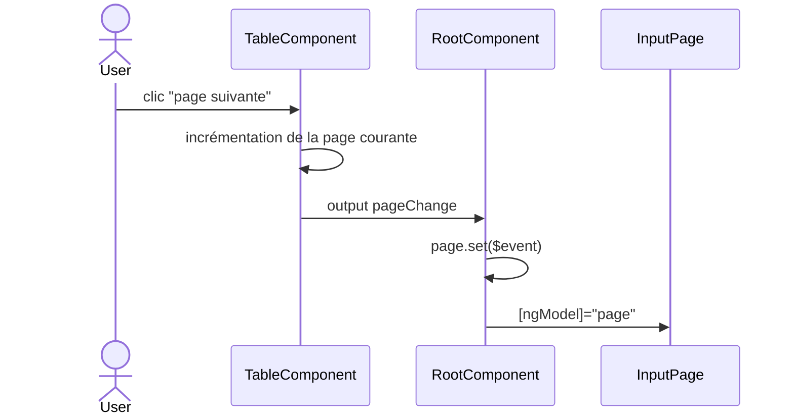

# L3M, CL&IHM 2024-2025 : Support cours 1 - 3

On illustre des notions de `Typescript` à l'aide d'un exemple de traitement des données.

| rentree_scolaire | academie | departement | commune | denomination_principale | patronyme | secteur | rep | rep_plus | nombre_eleves_total | 6eme_total | 6eme_filles | 6emes_garcons | 6eme_lv1_allemand | 5eme_total | code_postal |
|--|--|--|--|--|--|--|--|--|--|--|--|--|--|--|--|
| 2020 | GRENOBLE | ARDECHE | ANNONAY | COLLEGE PRIVE | SACRE COEUR | PRIVE | 0 | 0 | 712 | 168 | 80 | 88 | 0 | 193 | 07100 | 

## Cours 3 Diagrammes de séquences entre composants

Que se passe-t-il quand l'utilisateur spécifie un filtre de recherche ?
On suppose que l'utilisateur saisie un filtre sur le nom des établissements scolaires.
On néglige dans ce diagramme de séquence la distinction entre la vue et la vue-modèle des composants (on détaillera cela après).

Si on "zoome" sur ce qui se passe autour du filtre lorsque l'utilisateur saisie un nouveau texte. On démarre avec la vue du composant filtre qui lève un événement (ngModelChange) à partir du composant input de cette vue.

On suppose maintenant que l'utilisateur à cliqué sur le bouton "page suivante" du composant TableComponent. On présente l'interaction que cela engendre au niveau des composants, sans entrer dans le détail des échanges entre vues et vues-modèles.
On explicite la présence du composant Input instancié dans la vue du composant racine et qui gère la page courante.

